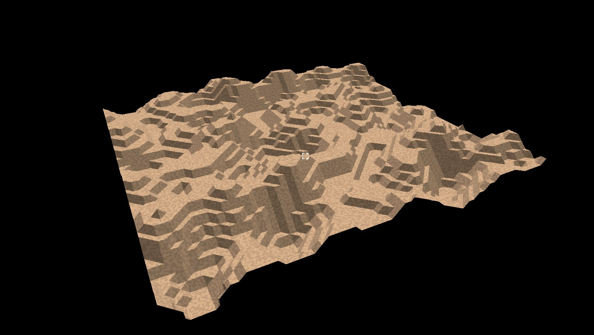

# KRATER

Прототип моей игры. Мир состоит из вокселей и отрисовываеться по алгоритму marching cubes. Текстурирование пока сделано на принципе 3D шума.  

## Управление

Вперёд - W.  
Влево  - A.  
Назад  - S.  
Вправо - D.  
Вверх  - Space.  
Вниз   - Lshift.  
Ставить блоки - правая кнопка мыши.  
Ломать блоки  - левая кнопка мыши.  
Вращение камеры мышью.  